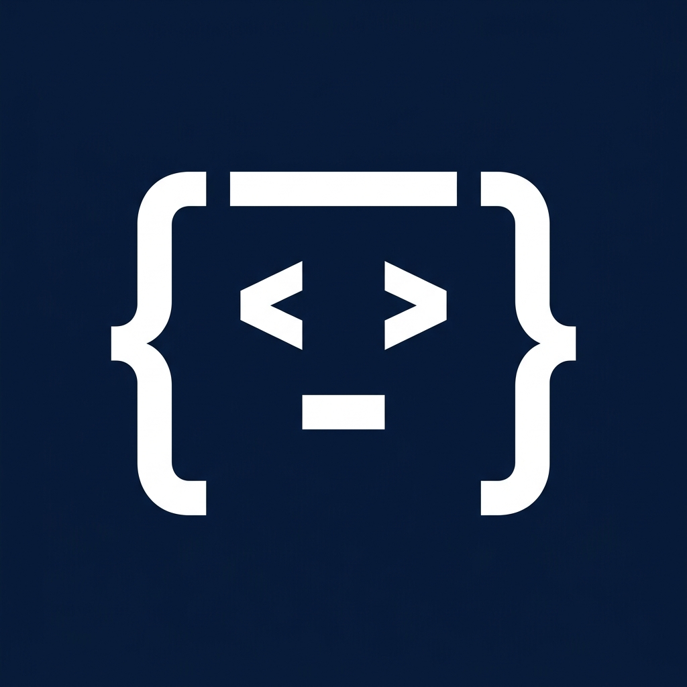

<div align="center">
  

  # Stella

  **A self-hosted, open-source AI software engineer.**

  [](https://opensource.org/licenses/MIT)
  [](https://www.python.org/downloads/)
</div>

<br />

Stella listens to GitHub webhooks, reads your issues, plans a solution, writes the code, runs tests, and opens a Pull Request—entirely autonomously.

------------------------------------------------------------------------

## Setup

### 1. Clone the Repository

``` bash
git clone https://github.com/sohamsangole/stella.git
cd stella
```

### 2. Create a Virtual Environment

``` bash
python3 -m venv venv
source venv/bin/activate
```

### 3. Install Dependencies

``` bash
pip install -r requirements.txt
```

------------------------------------------------------------------------

## Create a GitHub App

1.  Go to **GitHub → Settings → Developer settings → GitHub Apps**.
2.  Click **New GitHub App**.
3.  Set:

  Setting          Value
  ---------------- --------------------------
  Homepage URL     `http://localhost:8000`
  Webhook URL      Your Smee URL
  Webhook Secret   Any secure random string

### Repository Permissions

Grant **Read & Write** access to:

-   Contents
-   Issues
-   Pull Requests

### Subscribe to Events

Enable:

-   Issue comments

### Generate Credentials

-   Generate a **Private Key (.pem)**
-   Download it
-   Install the GitHub App on your test repository

------------------------------------------------------------------------

## Configure Environment Variables

Create a `.env` file:

``` env
GITHUB_WEBHOOK_SECRET="your-webhook-secret"

REDIS_URL="redis://localhost:6379/0"

GITHUB_APP_ID="your-app-id"

GITHUB_PRIVATE_KEY_PATH="/absolute/path/to/private-key.pem"
```

------------------------------------------------------------------------

## Running Stella

Open **four terminals**.

### Terminal 1 --- Start Redis

``` bash
docker run -p 6379:6379 -d redis
```

### Terminal 2 --- Start Smee

Replace with your own Smee URL.

``` bash
npx smee-client \
  --url https://smee.io/your-channel \
  --target http://localhost:8000/webhook/github
```

### Terminal 3 --- Start FastAPI

``` bash
uvicorn main:app --reload --port 8000
```

### Terminal 4 --- Start Celery

``` bash
celery -A worker.app worker --loglevel=info
```

------------------------------------------------------------------------

## Usage

1.  Open an issue in your repository.
2.  Mention Stella in a comment:

``` text
@coding-agent-stella fix the login bug
```

3.  Stella will:

-   Receive the GitHub webhook
-   Queue the task in Redis
-   Celery picks up the task
-   Clone the repository
-   Generate a solution using the configured LLM
-   Commit the changes
-   Open a Pull Request


------------------------------------------------------------------------

## License

MIT License
