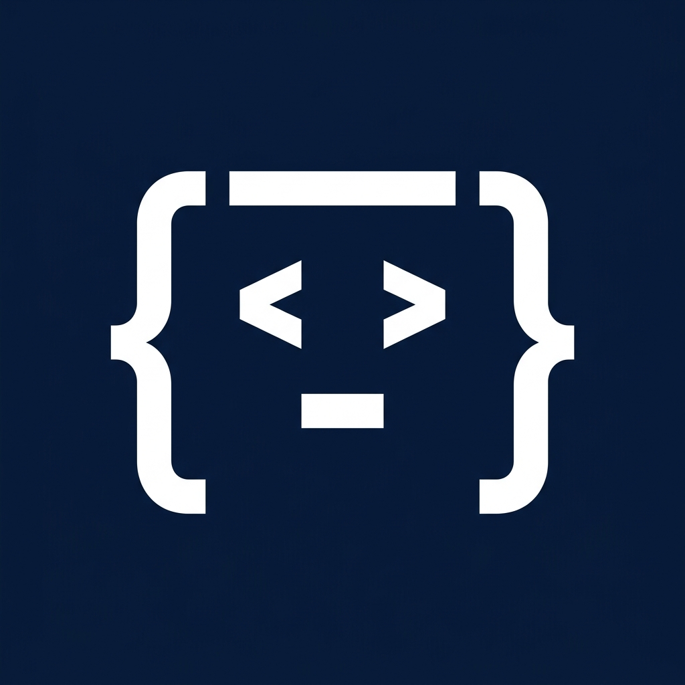

<div align="center">
  

  # Stella

  **A self-hosted, open-source AI software engineer.**

  [](https://opensource.org/licenses/MIT)
  [](https://www.python.org/downloads/)
</div>

<br />

Stella listens to GitHub webhooks, reads your issues, plans a solution, writes the code, runs tests, and opens a Pull Request—entirely autonomously.

---

## State Machine Architecture

Stella executes tasks through a deterministic, event-driven state machine loop:

```
[PLAN] ---> [CODE] ---> [REVIEW] ---> [TEST] ---> [COMPLETED]
  ^                         |           |
  |--- (review rejected) ---|           |
  |                                     |
  |------------- (test failed) ---------|
```

- **`PLAN`**: Analyzes the issue and generates/refines implementation instructions.
- **`CODE`**: Modifies the repository codebase based on the approved plan.
- **`REVIEW`**: Reviews code diffs against quality criteria (*returns to `PLAN` if changes requested*).
- **`TEST`**: Runs automated unit/integration tests (*returns to `PLAN` with error traceback if tests fail*).
- **`COMPLETED` / `FAILED`**: Final execution states.

All state transitions share a unified `StateContext` containing task metadata, transition history, and state data artifacts (`model.data`).

---

## Project Structure

```text
stella/
├── api/                     # FastAPI server & GitHub webhook endpoint
│   └── main.py
├── core/                    # Settings, State Machine engine, & Celery worker
│   ├── config.py
│   ├── state_machine.py
│   └── worker.py
├── states/                  # Execution runners for each state
│   ├── base.py
│   ├── plan.py
│   ├── code.py
│   ├── review.py
│   └── test.py
├── agents/                  # Execution agents
│   └── agent_runner.py
├── workspace/               # Isolated git repository workspace sandbox
│   └── workspace.py
└── clients/                 # Third-party API wrappers
    └── github_client.py

tests/                       # Unit & integration test suite
```

---

## Setup

### 1. Clone the Repository

```bash
git clone https://github.com/sohamsangole/stella.git
cd stella
```

### 2. Create a Virtual Environment

```bash
python3 -m venv venv
source venv/bin/activate
```

### 3. Install Dependencies

```bash
pip install -r requirements.txt
```

---

## Create a GitHub App

1. Go to **GitHub → Settings → Developer settings → GitHub Apps**.
2. Click **New GitHub App**.
3. Set:

| Setting | Value |
| :--- | :--- |
| Homepage URL | `http://localhost:8000` |
| Webhook URL | Your Smee URL |
| Webhook Secret | Any secure random string |

### Repository Permissions
Grant **Read & Write** access to:
- Contents
- Issues
- Pull Requests

### Subscribe to Events
Enable:
- Issue comments

### Generate Credentials
- Generate a **Private Key (.pem)**
- Download it and place it under `private_key/`
- Install the GitHub App on your test repository

---

## Configure Environment Variables

Create a `.env` file in the project root:

```env
GITHUB_WEBHOOK_SECRET="your-webhook-secret"

REDIS_URL="redis://localhost:6379/0"

# Optional parent directory for temporary task workspaces.
# Leave empty to use the operating system's temporary directory.
WORKSPACE_ROOT=""

GITHUB_APP_ID="your-app-id"

GITHUB_PRIVATE_KEY_PATH="/absolute/path/to/private-key.pem"
```

---

## Running Stella

Open **four terminals**.

### Terminal 1 --- Start Redis

```bash
docker run -p 6379:6379 -d redis
```

### Terminal 2 --- Start Smee Client

Replace with your own Smee URL:

```bash
npx smee-client \
  --url https://smee.io/your-channel \
  --target http://localhost:8000/webhook/github
```

### Terminal 3 --- Start FastAPI Webhook Server

```bash
uvicorn stella.api.main:app --reload --port 8000
```

### Terminal 4 --- Start Celery Worker

```bash
celery -A stella.core.worker.app worker --loglevel=info
```

---

## Testing

Run the automated test suite:

```bash
python3 -m unittest discover -s tests
```

---

## Usage

1. Open an issue in your repository.
2. Mention Stella in a comment:

```text
@coding-agent-stella fix the login bug
```

3. Stella will:
- Receive the GitHub webhook payload
- Queue the task in Redis / Celery
- Clone the repository into an isolated temporary workspace
- Initialize the task `StateContext` & `StateMachine`
- Post an issue comment acknowledging receipt
- Clean up the temporary workspace upon task completion

---

## License

MIT License
